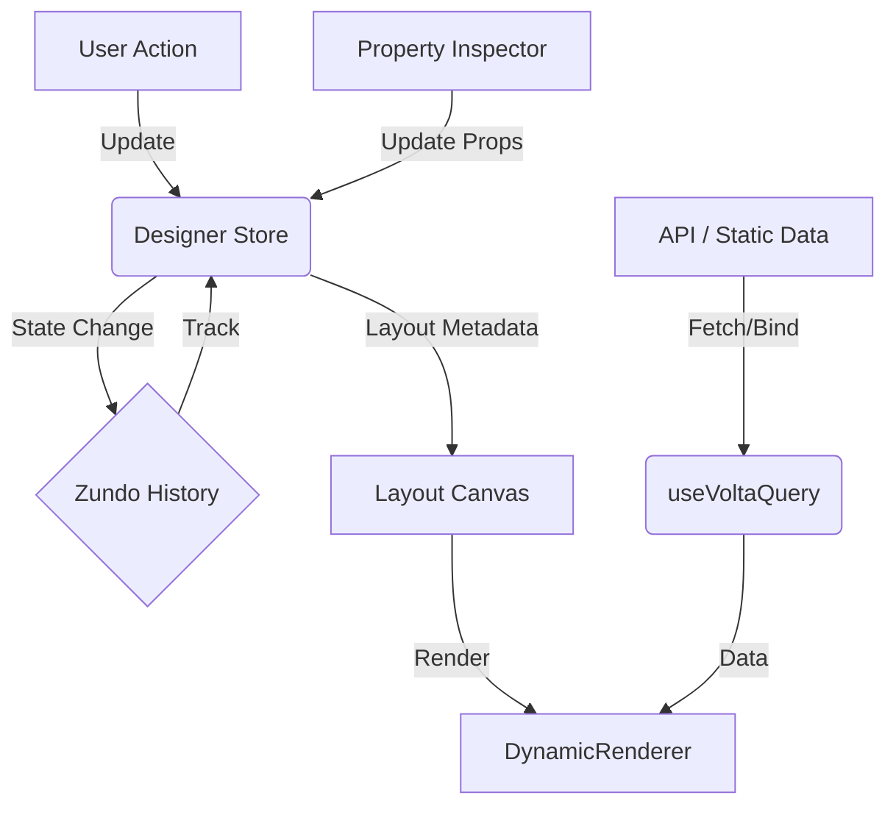

# Architecture Overview

Volta is built on a **metadata-driven architecture**. This means the application's structure, layout, and behavior are defined by JSON configuration rather than hard-coded logic. This approach allows for rapid development, easy updates, and runtime flexibility.

## Core Concepts

### 1. The Designer (`src/designer` & `src/components/designer`)

The Designer is the visual environment for building applications. It has been refactored into modular components for better maintainability and scalability (`DesignerV2`).

- **Designer Store (`src/core/state-management/stores/designerStore.ts`)**: Centralized state management using **Zustand**. It tracks the current layout, selected components, and active modes.
- **Undo/Redo**: Integrated via **Zundo**, allowing time-travel debugging and history management for all layout changes.
- **Component Palette (`ComponentPaletteV2`)**: Lists available components registered in the `componentRegistry`.
- **Canvas (`LayoutCanvas`)**: The interactive drag-and-drop area where the page layout is constructed.
- **Property Inspector (`PropertyInspectorV2`)**: A dynamic panel for configuring component properties (props, styles) based on their Zod schema definitions.
- **Data Source Editor**: A specialized tool for binding components to various data sources (API, Static JSON, or other Component bindings).
- **Headless Integration**: The designer leverages standard UI components that are decoupled from logic.

### 2. Headless Components (`src/components/headless`)

Volta employs a **Headless UI** pattern. Core functionalities (like Data Tables, Forms) are implemented as "headless" hooks or logical components that handle state and behavior, leaving the visual rendering to the specific implementation (e.g., in the Designer or Runtime).

- **Separation of Concerns**: Logic resides in `src/components/headless`, while UI rendering is distinct.
- **Reusability**: The same logic drives both the Designer preview and the actual Runtime application.

### 3. The Runtime (`src/runtime`)

The Runtime engine consumes the **Page Metadata** generated by the Designer to render the final application.

- **Dynamic Renderer**: Recursively builds the component tree from the JSON metadata.
- **Routing**: Managing application navigation.
- **State**: Global application state handling.

### 4. Data Layer

Data handling in Volta is flexible and configuration-based.

- **Data Source Config**: Components can be configured with different data sources:
  - `api`: Fetches data from configured endpoints.
  - `static`: Uses hardcoded JSON data.
  - `binding`: Binds to data from other components or global state.
- **ApiClient**: A unified client for making HTTP requests, supporting authentication and interceptors.

## Data Flow

## Directory Structure Highlights

- `src/components/designer`: Visual components specific to the Designer UI (Palette, Canvas, Inspector).
- `src/components/headless`: Logical components (Hooks, Contexts) without UI.
- `src/core/state-management`: Zustand stores (`designerStore`, `runtimeStore`).
- `src/designer`: Core Designer views and layout logic.
- `src/runtime`: The engine for rendering the end-user application.
