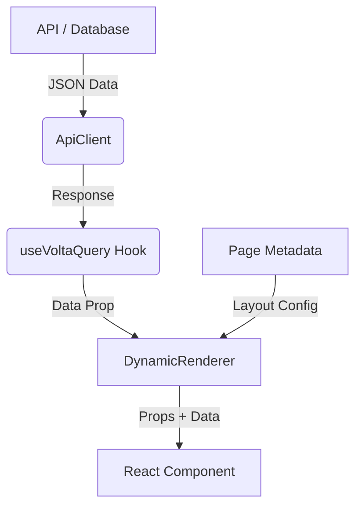

# Architecture Overview

Volta is built on a **metadata-driven architecture**. This means the application's structure, layout, and behavior are defined by JSON configuration rather than hard-coded logic. This approach allows for rapid development, easy updates, and runtime flexibility.

## Core Concepts

### 1. The Designer (`src/designer`)

The Designer is a visual editor where you build your application. It provides:

- **Component Palette**: A list of available components (configured in `componentRegistry`).
- **Canvas**: A drag-and-drop area to arrange components.
- **Property Inspector**: A panel to configure component properties (props, styles).
- **Data Source Editor**: A tool to bind components to APIs or static data.

The output of the Designer is a **Page Metadata** JSON object.

### 2. The Runtime (`src/runtime`)

The Runtime is the engine that consumes the Page Metadata and renders the actual user interface. It is optimized for performance and responsible for:

- **Routing**: Handling navigation between pages.
- **State Management**: Managing global application state.
- **Dynamic Rendering**: Recursively rendering the component tree based on metadata.

### 3. Rendering Engine (`src/core/rendering-engine`)

The heart of Volta is the `DynamicRenderer`. It takes a `ComponentMetadata` object and:

1.  Resolves the React component from the `componentRegistry`.
2.  Fetches necessary data (if an API data source is configured).
3.  Injects the data and configured properties into the component.
4.  Renders the component.

## Data Flow

1.  **Configuration**: Endpoints are defined in `voltaboard.config.ts`.
2.  **Fetching**: The `useVoltaQuery` hook uses `ApiClient` to fetch data.
3.  **Binding**: Data is passed to components via the `data` prop.
4.  **Rendering**: Components render based on their props.
